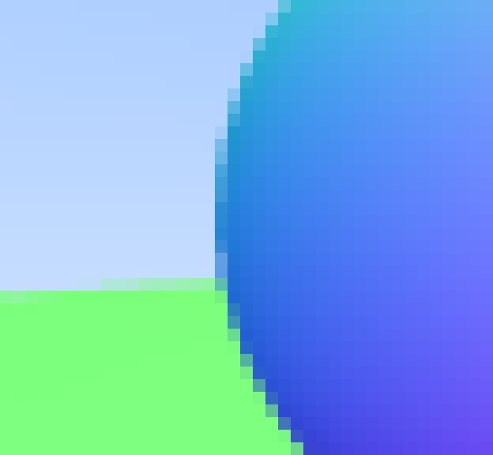

# Antialiasing

Quand une vraie caméra prend une photo, en général, les bords ne sont pas crenelés car les pixels des bords des objets sont un mélange de premier-plan et d'arrière-plan. Nous poutons obtenir le même effet en faisant la moyenne d'un lot d'échantillons à l'intérieur de chaque pixel. 

Une chose dont nous avons besoin est un générateur de nombres aléatoires qui renvoies des nombres réels aléatoires. Nous avons besoin d'une fonction qui renvoie un nombre aléatoire canonique, qui, par convention, renvoie un réel aléatoire dans la plage \\(0 \leq r < 1 \\). Le 'strictement inférieur' avant le 1 est important car nous en profiterons, comme vous le verrez plus tard.

Une approche simple consiste à utiliser la fonction `rand()` qui se trouve dans `<cstdlib>`. Cette fonction renvoie un entier aléatoire compris entre 0 et `RAND_MAX`. Par conséquent, nous pouvons obtenir un nombre réel aléatoire comme souhaité avec l'extrait de code suivant, ajouté à `rtweekend.h` :

```cpp
#include <cstdlib>
...

inline double random_double() {
    // Returns a random real in [0,1).
    return rand() / (RAND_MAX + 1.0);
}

inline double random_double(double min, double max) {
    // Returns a random real in [min,max).
    return min + (max-min)*random_double();
}
```

Le C++ traditionnel n'a pas de générateur de nombre aléatoire standard, seules les versions récentes du C++ ont adressé ce problème par l'en-tête `<random>` (même si imparfait). Si vous voulez l'utiliser, vous pouvez obtenir un nombre aléatoire respectant les conditions dont nous avons besoin avec ce code :

```cpp
#include <functional>
#include <random>

inline double random_double() {
    static std::uniform_real_distribution<double> distribution(0.0, 1.0);
    static std::mt19937 generator;
    static std::function<double()> rand_generator =
        std::bind(distribution, generator);
    return rand_generator();
}
```

Pour un pixel donné, nous avons plusieurs échantillons à l'intérieur de ce pixel et des rayons traversant chacun de ces échantillons. Les couleurs de ses rayons sont ensuite moyennées :


Nous pouvons encapsuler ce nouveau concept dans la classe `camera` qui reste aligné sur l'axe comme précédemment :

```cpp
#ifndef CAMERA_H
#define CAMERA_H

#include "rtweekend.h"

class camera {
    public:
        camera() {
            lower_left_corner = vec3(-2.0, -1.0, -1.0);
            horizontal = vec3(4.0, 0.0, 0.0);
            vertical = vec3(0.0, 2.0, 0.0);
            origin = vec3(0.0, 0.0, 0.0);
        }

        ray get_ray(double u, double v) {
            return ray(origin, lower_left_corner + u*horizontal + v*vertical - origin);
        }

    public:
        vec3 origin;
        vec3 lower_left_corner;
        vec3 horizontal;
        vec3 vertical;
};
#endif
```

Pour gérer le multi-échantillonage du calcul de la couleur, nous allons mettre à jour la fonction `vec3::write_color()`. Plutôt que d'ajouter une petite fraction de la contribution à chaque fois que nous accumulons plus de lumière à la couleur, nous ajoutons simplement la couleur pleine à chaque itération et seulement à la fin, nous divison le résultat par le nombre de samples/échantillons quand nous écrivons la couleur. En plus de ça, nous allons ajouter une fonction pratique à `rtweekend.h` : `clamp(x, min, max)` qui borne la valeur \\(x \\) dans l'intervalle \\([min, max] \\) :

```cpp
inline double clamp(double x, double min, double max) {
    if (x < min) return min;
    if (x > max) return max;
    return x;
}
```

vec3.h :
```cpp
void write_color(std::ostream &out, int samples_per_pixel) {
    // Divide the color total by the number of samples.
    auto scale = 1.0 / samples_per_pixel;
    auto r = scale * e[0];
    auto g = scale * e[1];
    auto b = scale * e[2];

    // Write the translated [0,255] value of each color component.
    out << static_cast<int>(256 * clamp(r, 0.0, 0.999)) << ' '
        << static_cast<int>(256 * clamp(g, 0.0, 0.999)) << ' '
        << static_cast<int>(256 * clamp(b, 0.0, 0.999)) << '\n';
}
```

La fonction `main` change également :

```cpp
int main() {
    const int image_width = 200;
    const int image_height = 100;
    const int samples_per_pixel = 100;

    std::cout << "P3\n" << image_width << " " << image_height << "\n255\n";

    hittable_list world;
    world.add(make_shared<sphere>(vec3(0,0,-1), 0.5));
    world.add(make_shared<sphere>(vec3(0,-100.5,-1), 100));
    camera cam;
    for (int j = image_height-1; j >= 0; --j) {
        std::cerr << "\rScanlines remaining: " << j << ' ' << std::flush;
        for (int i = 0; i < image_width; ++i) {
            vec3 color(0, 0, 0);
            for (int s = 0; s < samples_per_pixel; ++s) {
                auto u = (i + random_double()) / image_width;
                auto v = (j + random_double()) / image_height;
                ray r = cam.get_ray(u, v);
                color += ray_color(r, world);
            }
            color.write_color(std::cout, samples_per_pixel);
        }
    }

    std::cerr << "\nDone.\n";
}
```

Maintenant, si nous zoomons sur l'image produite, le grand changement est sur les bords/arêtes qui appartiennent au premier plan et à l'arrière-plan :

