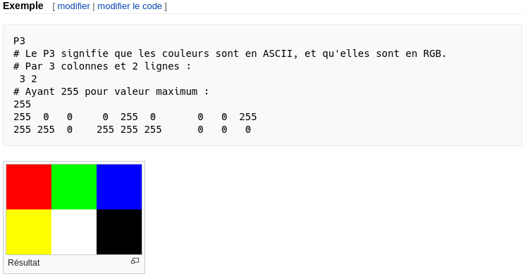

# Créer une image

A chaque fois que l'on démarre la création d'un moteur de rendu, nous avons besoin de voir une image. La façon la plus simple est d'écrire l'image dans un fichier. Le problème est qu'il existe un innombrable format d'images et que beaucoup d'entre eux sont complexes. Je commence toujours par des fichiers textes ppm. Wikipedia en fait une belle description :



Ecrivons un peu de C++ pour sortir un fichier similaire :
```cpp
#include <iostream>

int main() {
    const int image_width = 200;
    const int image_height = 100;

    std::cout << "P3\n" << image_width << ' ' << image_height << "\n255\n";

    for (int j = image_height-1; j >= 0; --j) {
        for (int i = 0; i < image_width; ++i) {
            auto r = double(i) / image_width;
            auto g = double(j) / image_height;
            auto b = 0.2;
            int ir = static_cast<int>(255.999 * r);
            int ig = static_cast<int>(255.999 * g);
            int ib = static_cast<int>(255.999 * b);
            std::cout << ir << ' ' << ig << ' ' << ib << '\n';
        }
    }
}
```

Il y a plusieurs choses à noter dans ce code :
1. Les pixels sont écrits en lignes, de la gauche vers la droite.
2. Les lignes sont écrites du haut vers le bas.
3. Par convention, chaque composant RVB(rouge/vert/bleu ou RGB en anglais) a une valeur allant de 0.0 à 1.0. Nous assouplirons cette contrainte plus tard quand nous utiliserons une plage HDR (high dynamic range), sachant qu'avant de sortir une image HDR nous allons contraindre les valeurs dans l'intervale de zéro à un, donc ce code ne changera pas.
4. La composante rouge va du noir au maximum de gauche à droite et le vert va du noir en bas, jusqu'au maximum en haut. Le rouge et le vert ensemble forment du jaune, donc on doit s'attendre à ce que coin supérieur droit soit jaune.

Parce que le programme n'écrit pas directement dans un fichier mais dans sa sortie standard, nous avons besoin de rédiger celle-ci dans un fichier.
Généralement, c'est fait depuis la ligne de commande en utilisant le chevron '>' pour rediriger la sortie vers un fichier :
`
build\Release\inOneWeekend.exe > image.ppm
`