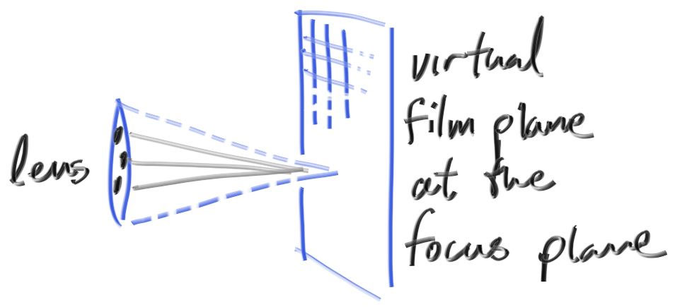

# Flou de focus

Développons à présent notre fonctionnalité finale : le flou de focus. Notez que tous les photographes l'appellent "flou de profondeur" donc préférez le terme "flou de focus" (*defocus blur*) avec vos amis.

La raison pour laquelle le flou de focus existe sur de vrais appareils photos est parce qu'ils ont besoin d'un grand trou (plutôt qu'un petit point) pour obtenir de la lumière. Ca rendra tout flou, mais si on insère une lentille dans ce trou, il y aura une certaine distance où tout sera en focus. VOus pouvez imaginer une lentille de la sorte : tous les rayons lumineux venant d'un point spécique à la distance focale - et qui touche la lentille - sera recourbé vers un seul point sur le capteur d'image.

Sur un appareil photo physique, la distance au plan à partir duquel les choses sont en focus est controllé par la distance entre la lentille et la pellicule/capteur. C'est pour cette raison que l'on voit la lentille se déplacer relativement vers la caméra quand on change ce qui est en focus (ce phénomèneme apparait sur votre smartphone également, mais c'est le capteur qui bouge dans ce cas). L'ouverture (*aperture*) est un trou qui controle le taille effective de la lentille. Pour un vrai appareil photo, si vous avez besoin de plus de lumière, vous pouvez agrandir l'ouverture, et par la même occasion vous obtiendrez plus de flou de focus. Pour notre caméra virtuelle, nous pouvons avoir un capteur parfait et ne jamais avoir besoin de plus de lumière, donc seulement quand nous voudrons un flou de focus nous utiliserons le principe de l'ouverture/*aperture*.

Un vrai appareil photo a une lentille composée complexe. Dans notre code, nous allons simuler l'ordre : capteur, ensuite lentille, puis ouverture, et déduire où envoyer les rayons puis renverser (*flip*) l'image une fois calculée (l'image est projetée à l'envers sur la pellicule). En général, nous utilisons le modèle d'approximation d'une lentille fine :


Nous n'avons pas besoin de simuler l'intérieur de l'appareil photo. Pour notre besoin de faire le rendu d'une image à l'extérieur de la caméra, ça serait une complexité non nécessaire. A la place, je fais commencer les rayons de la surface de la lentille et je les envoie vers une pellicule virtuelle plane, en trouvant la projection de la pellicule sur le plan qui est en focus (à la distance que nous noterons `focus_dist`).



Normalement, tous les rayons de la scène ont comme origine le point `lookfrom`. Afin de réaliser un flou de focus, nous générons des rayons aléatoires qui commencent à l'intérieur d'un disque centré sur le point `lookfrom`. Plus grand est le rayon de ce disque, plus grand sera le flou de focus. Vous pouvez imaginer que notre caméra de départ avait le rayon de ce disque de defocus égal à zéro (donc aucun flou). De cette manière, tous les rayons étaient lancés à partir du centre du disque (`lookfrom`).

Générons des points aléatoires à l'intérieur d'un disque de rayon unitaire :
```cpp
vec3 random_in_unit_disk() {
    while (true) {
        auto p = vec3(random_double(-1,1), random_double(-1,1), 0);
        if (p.length_squared() >= 1) continue;
        return p;
    }
}
```

Changeons la définition de notre classe `camera` un peu pour qu'elle puisse avoir une profondeur de champs ajustable (*depth-of-field* ou *dof*) : 
```cpp
class camera {
    public:
        camera(
            vec3 lookfrom, vec3 lookat, vec3 vup,
            double vfov, // top to bottom, in degrees
            double aspect, double aperture, double focus_dist
        ) {
            origin = lookfrom;
            lens_radius = aperture / 2;

            auto theta = degrees_to_radians(vfov);
            auto half_height = tan(theta/2);
            auto half_width = aspect * half_height;

            w = unit_vector(lookfrom - lookat);
            u = unit_vector(cross(vup, w));
            v = cross(w, u);
            lower_left_corner = origin
                              - half_width * focus_dist * u
                              - half_height * focus_dist * v
                              - focus_dist * w;

            horizontal = 2*half_width*focus_dist*u;
            vertical = 2*half_height*focus_dist*v;
        }

        ray get_ray(double s, double t) {
            vec3 rd = lens_radius * random_in_unit_disk();
            vec3 offset = u * rd.x() + v * rd.y();

            return ray(
                origin + offset,
                lower_left_corner + s*horizontal + t*vertical - origin - offset
            );
        }

    public:
        vec3 origin;
        vec3 lower_left_corner;
        vec3 horizontal;
        vec3 vertical;
        vec3 u, v, w;
        double lens_radius;
};
```

En utilisant une grande ouverture/*aperture* :
```cpp
const auto aspect_ratio = double(image_width) / image_height;
...
vec3 lookfrom(3,3,2);
vec3 lookat(0,0,-1);
vec3 vup(0,1,0);
auto dist_to_focus = (lookfrom-lookat).length();
auto aperture = 2.0;

camera cam(lookfrom, lookat, vup, 20, aspect_ratio, aperture, dist_to_focus);
```

Nous obtenons le résultat :
