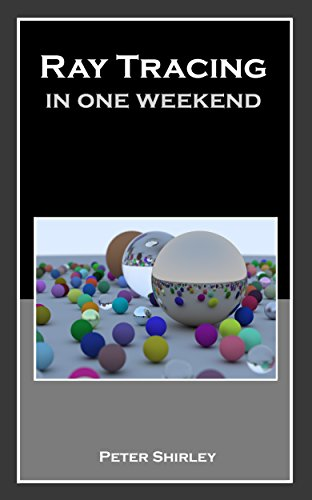

# Introduction

> Ce site est une traduction de l'excellente série de livres sur le raytracing de Peter Shirley. Le ray tracing, ou lancer de rayons en français, est une technique de calcul d'optique par ordinateur, notamment utilisée pour le rendu d'image de synthèse (source : [Wikipedia](https://fr.wikipedia.org/wiki/Ray_tracing)). Cette traduction est rendue possible grâce au choix de l'auteur de publier ses écrits sous license permissive CC0 (anciennement payants).

# Point de départ

J'ai enseigné pendant plusieurs années la programmation à destination de l'image. Souvent, j'enseigne le ray tracing (lancé de rayons), parce que vous êtes obligé d'écrire tout le code mais vous pouvez quand même obtenir des images super cools. J'ai décidé d'adapter mes notes de cours en manuel, pour que vous puissiez réaliser un programme cool, aussi vite que possible.
Ca ne sera pas un moteur de rendu par lancé de rayons complet mais il sera capable d'illumination indirecte, ce qui a permis aux films de gagner en réalisme. Suivez ces étapes, et l'architecture du ray tracer que vous allez produire sera suffisante pour que vous puissiez construire un ray tracer plus complet par la suite.

Quand quelqu'un parle de "ray tracing", ça peut vouloir dire plusieurs choses. Ce que je m'aprête à décrire est techniquellement un "path tracer" assez général. Alors que le code que vous allez écrire est très simple (laissons l'ordinateur faire le travail !), je pense que vous serez très satisfait des images que vous pourrez créer avec.

Je vais vous expliquer comme coder un ray tracer dans l'ordre auquel j'ai été habitué à le faire, ainsi que quelques conseils de débogage. A la fin, vous aurez un ray tracer qui produira de belles images. Vous serez capable de faire ça normalement en un weekend. Si ça vous prend plus de temps, ne vous en faites pas. J'utilise le C++ comme langage de programmation, mais vous n'avez pas besoin de faire pareil. Cependant, je vous suggère de le faire, parce que le C++ est rapide, portable et que la plupart des moteurs de rendu de films et jeux vidéos sont écrits en C++. Notez que j'éviterai d'utiliser les fonctionnalités modernes du C++, mais l'héritage et la surcharge d'opérateur sont trop utiles aux ray tracers pour passer outre. Je montre tout le code utilisé, excepté pour quelques calculs très simples pour la classe `vec3`. Je crois beaucoup au dicton "c'est en faisant que l'on apprend".

L'intégralité du code source est disponible ici :
[https://github.com/RayTracing/raytracing.github.io/](https://github.com/RayTracing/raytracing.github.io/).

Je suppose que vous êtes un peu familier avec les vecteurs (comme le produit scalaire et l'addition de deux vecteurs). Si vous n'y connaissez rien, faites quelques recherches avant de poursuivre.

Peter Shirley, edited by Steve Hollasch and Trevor David Black

Version 3.0.1, 2020-03-31

Copyright 2018-2020 Peter Shirley. All rights reserved.

Traduction française par Hugues Gaillard.