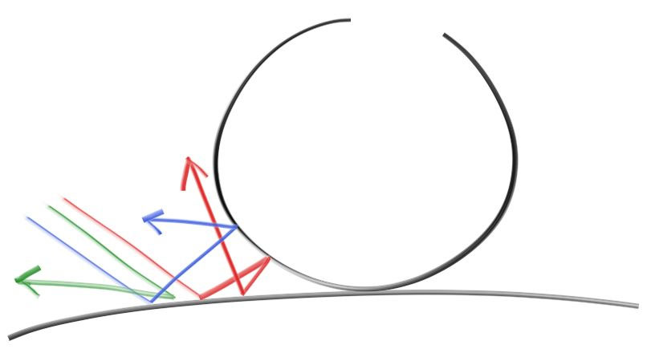

# Matériaux diffus

Maintenant que nous avons des objets et plusieurs rayons par pixel, nous pouvons passer du temps à la création de matériaux réalistes. Nous allons commencer par des matériaux diffus (mats). Une question est de savoir si l'on peut mélanger les formes et les matériaux (de façon à ce que nous puissons assigner à une sphère un matériau) ou si nous lions fortement la géométrie et les matériaux (utile dans le cas d'objet procéduraux où la forme et les matériaux sont liés). Nous allons choisir la voie de l'assignation séparée - ce qui est habituel pour la plupart des moteurs de rendu - mais soyez au courant de ce choix.

Les objets diffus qui n'émettent pas de lumière ne prennent que très légèrement la couleur de leur environnement, mais ils la modulent avec leur propre couleur intrinsèque. La lumière qui se reflète d'une surface diffuse a une direction aléatoire. Ainsi, si nous lançons des rayons dans une fente entre deux surfaces diffuses, ils auront chacun un comportement aléatoire différent :



Les rayons peuvent également être absorbés plutôt que reflétés. Plus sombre est la surface, plus l'absorption est probable. (C'est pourquoi il fait sombre!) N'importe quel algorithme qui "randomise" la direction produira une surface qui a une apparence mate. Une des façons les plus simples pour faire ça se révèle en fait idéale pour l'approximation de surface `Lambertian`. 

Il y a deux sphères de rayon unitaire tangentes au point d'impact \\(p\\) de la surface. Ces deux sphères ont un centre de \\((p + \vec{N})\\) et \\((p - \vec{N})\\), où \\(\vec{N}\\) est la normale de la surface. La sphère qui a un centre à \\((p - \vec{N})\\) est considérée à *l'intérieure* de la surface, alors que la sphère de centre \\((p + \vec{N})\\) est considérée à *l'extérieure* de la surface. Choisir la sphère de rayon unitaire tangente qui est du même côté de la surface que l'origine du rayon. CHoisir un point aléatoire \\(s\\) à l'intérieur de la sphère de rayon unitaire et envoyer un rayon du point d'impact \\(p\\) au point aléatoire \\(s\\) (c'est le vecteur \\((s-p)\\)) :


Nous avons besoin d'un moyen de générer un point aléatoire dans une sphère de rayon unitaire. Nous allons utiliser l'algorithme le plus simple : la méthode par rejet. En premier, il faut générer un point aléatoire dans un cube de dimension unitaire où x, y et z sont dans l'intervalle -1 à +1. Rejeter le point et re-essayer si le point est en dehors de la sphère.

On ajoute des méthodes pour générer un `vec3` aléatoire :
```cpp
class vec3 {
  public:
    ...
    inline static vec3 random() {
        return vec3(random_double(), random_double(), random_double());
    }

    inline static vec3 random(double min, double max) {
        return vec3(random_double(min,max), random_double(min,max), random_double(min,max));
    }
```

La fonction `random_in_unit_sphere()` :
```cpp
vec3 random_in_unit_sphere() {
    while (true) {
        auto p = vec3::random(-1,1);
        if (p.length_squared() >= 1) continue;
        return p;
    }
}
```

Ensuite, mettez à jour la fonction `ray_color()` pour utiliser le générateur de direction aléatoire :
```cpp
vec3 ray_color(const ray& r, const hittable& world) {
    hit_record rec;

    if (world.hit(r, 0, infinity, rec)) {
        vec3 target = rec.p + rec.normal + random_in_unit_sphere();
        return 0.5 * ray_color(ray(rec.p, target - rec.p), world);
    }

    vec3 unit_direction = unit_vector(r.direction());
    auto t = 0.5*(unit_direction.y() + 1.0);
    return (1.0-t)*vec3(1.0, 1.0, 1.0) + t*vec3(0.5, 0.7, 1.0);
}
```

Il y a un problème potentiel avec cette implémentation. Notez que la fonction `ray_color` est récursive. Quand sa récursion s'arrêtera ? Quand la fonction échouera de `hit` quelque chose. Dans certains cas, ça peut être très lent - assez longtemps pour exploser le *stack*. Pour se protéger contre ça, limitons la profondeur de recursion maximale, retournant aucune contribution de lumière à la profondeur maximale :

```cpp
vec3 ray_color(const ray& r, const hittable& world, int depth) {
    hit_record rec;

    // If we've exceeded the ray bounce limit, no more light is gathered.
    if (depth <= 0)
        return vec3(0,0,0);

    if (world.hit(r, 0, infinity, rec)) {
        vec3 target = rec.p + rec.normal + random_in_unit_sphere();
        return 0.5 * ray_color(ray(rec.p, target - rec.p), world, depth-1);
    }

    vec3 unit_direction = unit_vector(r.direction());
    auto t = 0.5*(unit_direction.y() + 1.0);
    return (1.0-t)*vec3(1.0, 1.0, 1.0) + t*vec3(0.5, 0.7, 1.0);
}
...
int main() {
    const int image_width = 200;
    const int image_height = 100;
    const int samples_per_pixel = 100;
    const int max_depth = 50;

    ...
    for (int j = image_height-1; j >= 0; --j) {
        std::cerr << "\rScanlines remaining: " << j << ' ' << std::flush;
        for (int i = 0; i < image_width; ++i) {
            vec3 color(0, 0, 0);
            for (int s = 0; s < samples_per_pixel; ++s) {
                auto u = (i + random_double()) / image_width;
                auto v = (j + random_double()) / image_height;
                ray r = cam.get_ray(u, v);
                color += ray_color(r, world, max_depth);
            }
            color.write_color(std::cout, samples_per_pixel);
        }
    }

    std::cerr << "\nDone.\n";
}
```

Ce qui nous donne l'image :


Notez l'ombre sous la sphère. L'image est très sombre, mais nos sphères n'absorbent que la moitié de l'énergie à chaque rebond, elles sont donc réflectives à 50%. Si vous ne voyez pas l'ombre, ne vous inquiètez pas, nous allons y remédier maintenant. Ces sphères doivent être assez lumineuses en réalité (gris clair). La raison à cela est que la plupart des lecteurs d'image assume que l'image est "gamma corrigé". Ce qui veut dire que les valeurs de 0 à 1 ont une transformation appliquée avant d'être enregistré. Il y a plusieurs bonnes raisons à cela, mais pour notre but, nous avons juste besoin de savoir ça. Pour une première approximation, nous pouvons utiliser "gamma 2" ce qui signifie mettre la couleur à la puissance *1/gamma*, ou dans cas, 1/2, ce qui correspond à la racine-carrée :

La fonction `write_color()` avec correction du gamma :

```cpp
void write_color(std::ostream &out, int samples_per_pixel) {
    // Divide the color total by the number of samples and gamma-correct
    // for a gamma value of 2.0.
    auto scale = 1.0 / samples_per_pixel;
    auto r = sqrt(scale * e[0]);
    auto g = sqrt(scale * e[1]);
    auto b = sqrt(scale * e[2]);

    // Write the translated [0,255] value of each color component.
    out << static_cast<int>(256 * clamp(r, 0.0, 0.999)) << ' '
        << static_cast<int>(256 * clamp(g, 0.0, 0.999)) << ' '
        << static_cast<int>(256 * clamp(b, 0.0, 0.999)) << '\n';
}
```

Ce qui nous donne une sphère grise claire, comme nous le désirions :

