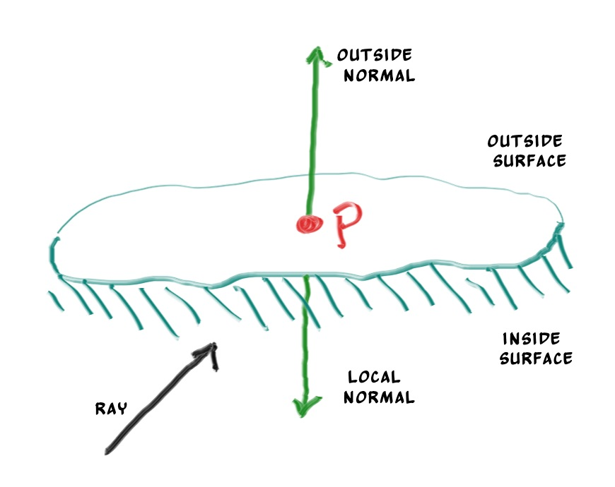
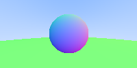

# Normale à une surface et plusieurs objets

Premièrement, définissons ce qu'est une normale, puis utilisons ce concept pour nuancer/ombrager les objets.
Une normale est un vecteur qui est perpendiculaire à la surface au point d'intersection. Il y a deux façons de concevoir des normales.
La première est de faire une normale à partir d'un vecteur de longueur unitaire. C'est pratique pour nuancer/ombrager donc je dirai que c'est une bonne solution, mais comme dit précédemment, je ne vais pas le faire dans le code. Ca peut entrainer des bugs difficiles à débusquer.

Pour une sphère, la normale extérieure est dans la direction du point d'impact, auquel on aurait soustrait la position du centre :


Si on prend la terre pour exemple, ça implique donc que le vecteur qui part du centre de la terre au point jusqu'à vous pointe vers le haut.

Implémentons ça et voyons le résultat.

Pour l'instant, nous n'avons aucune lumière donc nous allons devoir visualiser les normales en utilisant un jeu de couleurs. 
Une astuce utilisée fréquemment pour la visualisation de normales (car facile et intuitif d'assumer que \\(N\\) est un vecteur de longueur unitaire, donc chacun de ses composants est entre -1 et 1) est d'associer à chaque composant de l'intervalle 0 à 1, la valeur x/y/z en r/g/b. 
Pour une normale, nous avons besoin du point d'intersection, pas seulement savoir si le rayon a touché ou non la sphère. Nous allons assumer que la normale est désignée par le point d'intersection le plus proche (le plus petit \\(t\\) possible).

Notre code modifié qui nous permet de calculer et visualiser \\(N\\) est le suivant :
```cpp
double hit_sphere(const vec3& center, double radius, const ray& r) {
    vec3 oc = r.origin() - center;
    auto a = dot(r.direction(), r.direction());
    auto b = 2.0 * dot(oc, r.direction());
    auto c = dot(oc, oc) - radius*radius;
    auto discriminant = b*b - 4*a*c;
    if (discriminant < 0) {
        return -1.0;
    } else {
        return (-b - sqrt(discriminant) ) / (2.0*a);
    }
}

vec3 ray_color(const ray& r) {
    auto t = hit_sphere(vec3(0,0,-1), 0.5, r);
    if (t > 0.0) {
        vec3 N = unit_vector(r.at(t) - vec3(0,0,-1));
        return 0.5*vec3(N.x()+1, N.y()+1, N.z()+1);
    }
    vec3 unit_direction = unit_vector(r.direction());
    t = 0.5*(unit_direction.y() + 1.0);
    return (1.0-t)*vec3(1.0, 1.0, 1.0) + t*vec3(0.5, 0.7, 1.0);
}
```

Ce qui nous donne l'image suivante :


Chaque pixel de la sphère est coloré selon son vecteur normal. 

Revisitons l'équation de l'intersection d'un rayon et d'une sphère, précédemment nous avions :

```cpp
vec3 oc = r.origin() - center;
auto a = dot(r.direction(), r.direction());
auto b = 2.0 * dot(oc, r.direction());
auto c = dot(oc, oc) - radius*radius;
auto discriminant = b*b - 4*a*c;
```

Déjà, souvenez-vous qu'un vecteur dont on fait le produit scalaire (*dot product*) avec lui-même est égal au carré de la longueur de ce vecteur.
Deuxièmement, notez comment l'équation suivante a un facteur 2 pour \\(b\\). Observez ce qu'il se passe à l'équation quadratique si \\(b=2h\\) :

\\[ -b \pm \sqrt{b^2 - 4ac} \over{2a}\\]

\\[ = \frac{-2h \pm \sqrt{(2h)^2 - 4ac}}{2a}\\]

\\[ = \frac{-2h \pm 2\sqrt{h^2 - ac}}{2a}\\]

\\[ = \frac{-h \pm \sqrt{h^2 - ac}}{a}\\]

En utilisant ces observations, nous pouvons simplifier le code par ça :

```cpp
vec3 oc = r.origin() - center;
auto a = r.direction().length_squared();
auto half_b = dot(oc, r.direction());
auto c = oc.length_squared() - radius*radius;
auto discriminant = half_b*half_b - a*c;

if (discriminant < 0) {
    return -1.0;
} else {
    return (-half_b - sqrt(discriminant) ) / a;
}
```

Maintenant, comment gérer plusieurs sphères ? Il serait assez tentant de stocker un tableau de sphères, une solution très propre serait d'avoir une classe abtraite (que l'on ne peut pas instancier) pour chaque objet qu'un rayon pourrait traverser. De cette manière, une sphère, ou une liste de sphères pourraient être traversées. Le nom à donner à cette classe est un vrai dilemme : si on l'appelle objet ce n'est pas un bon nom puisqu'on fait de la programmation orientée objet par exemple. "Surface" est souvent utilisé, sauf que parfois nous voulons gérer des volumes... "hittable" (de l'anglais 'hit', touché, 'hittable', que l'on peut toucher) met en avant la principale fonction membre : 'hit'. Je n'aime aucun de ces choix mais partons sur 'hittable'.

Cette classe *hittable* aura donc une méthode qui prend en paramètre un rayon (*ray*). La plupart des raytracers a jugé bon d'ajouter un intervalle valide pour la valeur \\(t\\) pour que \\(t\\) soit compris entre \\(t_{min}\\) et \\(t_{max}\\). Si \\(t\\) ne respecte pas \\(t_{min} < t < t_{max}\\), le "hit" n'est pas détecté. Une question qui apparait maintenant est : doit-on calculer la normale si le rayon touche quelque chose ? On pourrait finir par toucher quelque chose de plus proche et du coup, nous n'aurions besoin que de la normale de l'objet le plus proche. Je vais partir sur la solution simple et calculer un lot de petites choses que je stockerai dans une structure.

Voici la classe abstraite 'hittable' :

```cpp
#ifndef HITTABLE_H
#define HITTABLE_H

#include "ray.h"

struct hit_record {
    vec3 p;
    vec3 normal;
};

class hittable {
    public:
        virtual bool hit(const ray& r, double t_min, double t_max, hit_record& rec) const = 0;
};

#endif
```

Et voici l'implémentation pour la sphère :

```cpp
#ifndef SPHERE_H
#define SPHERE_H

#include "hittable.h"
#include "vec3.h"

class sphere: public hittable {
    public:
        sphere() {}
        sphere(vec3 cen, double r) : center(cen), radius(r) {};

        virtual bool hit(const ray& r, double tmin, double tmax, hit_record& rec) const;

    public:
        vec3 center;
        double radius;
};

bool sphere::hit(const ray& r, double t_min, double t_max, hit_record& rec) const {
    vec3 oc = r.origin() - center;
    auto a = r.direction().length_squared();
    auto half_b = dot(oc, r.direction());
    auto c = oc.length_squared() - radius*radius;
    auto discriminant = half_b*half_b - a*c;

    if (discriminant > 0) {
        auto root = sqrt(discriminant);
        auto temp = (-half_b - root)/a;
        if (temp < t_max && temp > t_min) {
            rec.t = temp;
            rec.p = r.at(rec.t);
            rec.normal = (rec.p - center) / radius;
            return true;
        }
        temp = (-half_b + root) / a;
        if (temp < t_max && temp > t_min) {
            rec.t = temp;
            rec.p = r.at(rec.t);
            rec.normal = (rec.p - center) / radius;
            return true;
        }
    }
    return false;
}


#endif
```

Une deuxième question que l'on pourrait se poser est la direction dans laquelle les normales doivent toujours pointer. Jusqu'à présent, la normale trouvée sera toujours dans la direction du centre du point d'intersection (la normale pointe vers l'extérieur). Si le rayon intersectionne la sphère depuis l'extérieur, la normale pointera à l'opposée du rayon. Si le rayon intersectionne la sphère depuis l'intérieur, la normale (qui pointe toujours vers l'extérieure) pointera vers le rayon. De plus, nous pouvons avoir la normale qui pointe toujours à l'opposée du rayon. Si le rayon est à l'extérieur de la sphère, la normale pointera à l'extérieure, mais si le rayon est à l'intérieur de la sphère, la normale pointera vers l'intérieur.



Nous devons choisir une de ses possibilités et s'y tenir, car nous voudrons éventuellement déterminer de quel côté de la surface un rayon provient. C'est important pour les objets qui sont rendus de façon différente de chaque côté, comme du texte qu'on écrirait sur une feuille de papier ou pour des objets qui ont un intérieur et un extérieur, comme des boules de verre.

Si nous décidons d'avoir les normales qui pointent toujours vers l'extérieur, nous avons besoin de déterminer de quel côté le rayon est pour le colorer. On peut le déterminer en comparant le rayon avec la normale. Si le rayon et la normale pointent dans la même direction, le rayon est à l'intérieur de l'objet. Ca peut être déterminé en prenant le produit scalaire des deux vecteurs : si le produit scalaire est positif, le rayon est à l'intérieur de la sphère.

```cpp
if (dot(ray_direction, outward_normal) > 0.0) {
    // ray is inside the sphere
    ...
} else {
    // ray is outside the sphere
    ...
}
```

Si nous décidons d'avoir les normales qui pointent dans la direction opposée au rayon, nous ne pouvons pas utiliser le produit scalaire pour déterminer de quel côté de la surface le rayon est. A la place, nous avons besoin de stocker l'information :

```cpp
bool front_face;
if (dot(ray_direction, outward_normal) > 0.0) {
    // ray is inside the sphere
    normal = -outward_normal;
    front_face = false;
}
else {
    // ray is outside the sphere
    normal = outward_normal;
    front_face = true;
}
```

La décision de savoir si vous souhaitez avoir les normales qui pointent toujours vers l'extérieure ou toujours à l'opposées du rayon est liée à la décision de savoir si vous voulez déterminer le côté de la surface au moment de la géométrie ou au moment de la coloration. Dans ce livre, nous avons plus de "matériaux" (type de surface) que nous aurons de types de géométrie, donc nous choisirons la voie de la facilité et nous déterminerons l'endroit/l'envers de la surface au moment de la géométrie. C'est juste une question de goût et vous trouverez les deux implémentations dans la littérature.

Nous ajoutons la variable booléenne `front_face` à la structure `hit_record`. Je sais que nous aurons besoin plus tard de flou de mouvement, donc j'ajoute également une variable `t` pour stocker le temps.

```cpp
#ifndef HITTABLE_H
#define HITTABLE_H

#include "ray.h"

struct hit_record {
    vec3 p;
    vec3 normal;
    double t;
    bool front_face;

    inline void set_face_normal(const ray& r, const vec3& outward_normal) {
        front_face = dot(r.direction(), outward_normal) < 0;
        normal = front_face ? outward_normal :-outward_normal;
    }
};

class hittable {
    public:
        virtual bool hit(const ray& r, double t_min, double t_max, hit_record& rec) const = 0;
};

#endif
```

Et ensuite, nous ajoutons la détermination du côté de la surface dans la classe :

```cpp
bool sphere::hit(const ray& r, double t_min, double t_max, hit_record& rec) const {
    vec3 oc = r.origin() - center;
    auto a = r.direction().length_squared();
    auto half_b = dot(oc, r.direction());
    auto c = oc.length_squared() - radius*radius;
    auto discriminant = half_b*half_b - a*c;

    if (discriminant > 0) {
        auto root = sqrt(discriminant);
        auto temp = (-half_b - root)/a;
        if (temp < t_max && temp > t_min) {
            rec.t = temp;
            rec.p = r.at(rec.t);
            vec3 outward_normal = (rec.p - center) / radius;
            rec.set_face_normal(r, outward_normal);
            return true;
        }
        temp = (-half_b + root) / a;
        if (temp < t_max && temp > t_min) {
            rec.t = temp;
            rec.p = r.at(rec.t);
            vec3 outward_normal = (rec.p - center) / radius;
            rec.set_face_normal(r, outward_normal);
            return true;
        }
    }
    return false;
}
```

Nous ajoutons une liste d'objets :

```cpp
#ifndef HITTABLE_LIST_H
#define HITTABLE_LIST_H

#include "hittable.h"
#include <memory>
#include <vector>

using std::shared_ptr;
using std::make_shared;

class hittable_list: public hittable {
    public:
        hittable_list() {}
        hittable_list(shared_ptr<hittable> object) { add(object); }

        void clear() { objects.clear(); }
        void add(shared_ptr<hittable> object) { objects.push_back(object); }

        virtual bool hit(const ray& r, double tmin, double tmax, hit_record& rec) const;

    public:
        std::vector<shared_ptr<hittable>> objects;
};

bool hittable_list::hit(const ray& r, double t_min, double t_max, hit_record& rec) const {
    hit_record temp_rec;
    bool hit_anything = false;
    auto closest_so_far = t_max;

    for (const auto& object : objects) {
        if (object->hit(r, t_min, closest_so_far, temp_rec)) {
            hit_anything = true;
            closest_so_far = temp_rec.t;
            rec = temp_rec;
        }
    }

    return hit_anything;
}

#endif
```

## Quelques nouvelles fonctionnalités du C++

La classe `hittable_list` utilise deux fonctionnalités du C++ qui peuvent vous sembler inconnu si vous n'avez pas l'habitude de ce langage : `vector` et `shared_ptr`.

`shared_ptr<type>` est un pointeur vers un type alloué, avec une sémantique de comptage de références. Chaque fois que vous attribuez sa valeur à un autre pointeur partagé (`shared_ptr`, généralement avec une affectation simple), le nombre de références est incrémenté. Lorsque les pointeurs partagés sortent de la portée (comme à la fin d'un bloc ou d'une fonction), le nombre de références est décrémenté. Une fois que le nombre atteint zéro, l'objet est supprimé de la mémoire.

Habituellement, un `shared_ptr` est d'abord initialisé avec un un objet nouvellement alloué :
```cpp
shared_ptr<double> double_ptr = make_shared<double>(0.37);
shared_ptr<vec3>   vec3_ptr   = make_shared<vec3>(1.414214, 2.718281, 1.618034);
shared_ptr<sphere> sphere_ptr = make_shared<sphere>(vec3(0,0,0), 1.0);
```

`make_shared<thing>(thing_constructor_params ...)` alloue une nouvelle instance du type `thing` en utilisant les paramètres de constructeur. Cette fonction retourne un `shared_ptr<thing>`.

Puisque le type peut automatiquement être inféré par le type de retour de `make_shared<type>(...)`, les lignes au-dessus peuvent être reécrites plus simplement en utilisant le mot-clé `auto` :

```cpp
auto double_ptr = make_shared<double>(0.37);
auto vec3_ptr   = make_shared<vec3>(1.414214, 2.718281, 1.618034);
auto sphere_ptr = make_shared<sphere>(vec3(0,0,0), 1.0);
```

Nous utiliserons ces pointeurs partagés dans notre code, car ça permet à plusieurs géométries de partager une même instance (par exemple, un lot de sphères qui utilise le même matériau/texture) et parce que ça rend la gestion de la mémoire automatique et plus facile à comprendre.

`std::shared_ptr` est inclus avec le header `<memory>`.

La deuxième fonctionnalité du C++ qui peut vous sembler non familiaire est le `std::vector`. C'est une sorte de tableau générique. Dans le code au-dessus, nous utilisons une collection de pointeurs vers `hittable`. `std::vector` s'aggrandie automatiquement à chaque fois qu'une valeur est ajoutée : `objects.push_back(object)` ajoute une valeur à la fin du `std::vector`.

`std::vector` est inclus avec le header `<vector>`.

Finalement, l'instruction `using` indique au compilateur que nous obtenons `shared_ptr` et `make_shared` depuis la librairie standard `std`, donc nous n'avons pas besoin de les préfixer avec `std::` à chaque fois que nous y faisons référence.


## Constantes usuelles et fonctions utilitaires

Nous avons besoin de quelques constantes mathématiques donc nous les définissons dans un fichier d'en-tête qui leurs sont propres. Pour l'instant, nous n'avons besoin que de la valeur infinie, mais nous allons également y définir Pi. Nous allons également placer des fonctions utilitaires dans l'en-tête *rtweekend.h* .

```cpp
#ifndef RTWEEKEND_H
#define RTWEEKEND_H

#include <cmath>
#include <cstdlib>
#include <limits>
#include <memory>


// Usings

using std::shared_ptr;
using std::make_shared;

// Constants

const double infinity = std::numeric_limits<double>::infinity();
const double pi = 3.1415926535897932385;

// Utility Functions

inline double degrees_to_radians(double degrees) {
    return degrees * pi / 180;
}

inline double ffmin(double a, double b) { return a <= b ? a : b; }
inline double ffmax(double a, double b) { return a >= b ? a : b; }

// Common Headers

#include "ray.h"
#include "vec3.h"

#endif
```

Et le nouveau `main` :
```cpp
#include "rtweekend.h"

#include "hittable_list.h"
#include "sphere.h"

#include <iostream>
vec3 ray_color(const ray& r, const hittable& world) {
    hit_record rec;
    if (world.hit(r, 0, infinity, rec)) {
        return 0.5 * (rec.normal + vec3(1,1,1));
    }
    vec3 unit_direction = unit_vector(r.direction());
    auto t = 0.5*(unit_direction.y() + 1.0);
    return (1.0-t)*vec3(1.0, 1.0, 1.0) + t*vec3(0.5, 0.7, 1.0);
}

int main() {
    const int image_width = 200;
    const int image_height = 100;

    std::cout << "P3\n" << image_width << ' ' << image_height << "\n255\n";

    vec3 lower_left_corner(-2.0, -1.0, -1.0);
    vec3 horizontal(4.0, 0.0, 0.0);
    vec3 vertical(0.0, 2.0, 0.0);
    vec3 origin(0.0, 0.0, 0.0);

    hittable_list world;
    world.add(make_shared<sphere>(vec3(0,0,-1), 0.5));
    world.add(make_shared<sphere>(vec3(0,-100.5,-1), 100));

    for (int j = image_height-1; j >= 0; --j) {
        std::cerr << "\rScanlines remaining: " << j << ' ' << std::flush;
        for (int i = 0; i < image_width; ++i) {
            auto u = double(i) / image_width;
            auto v = double(j) / image_height;
            ray r(origin, lower_left_corner + u*horizontal + v*vertical);

            vec3 color = ray_color(r, world);

            color.write_color(std::cout);
        }
    }

    std::cerr << "\nDone.\n";
}
```

Ce qui nous donne l'image suivante qui est une visualisation de où se situe les normales sur la surface de la sphère. C'est souvent une bonne façon pour détecter des problèmes sur un modèle 3D.

