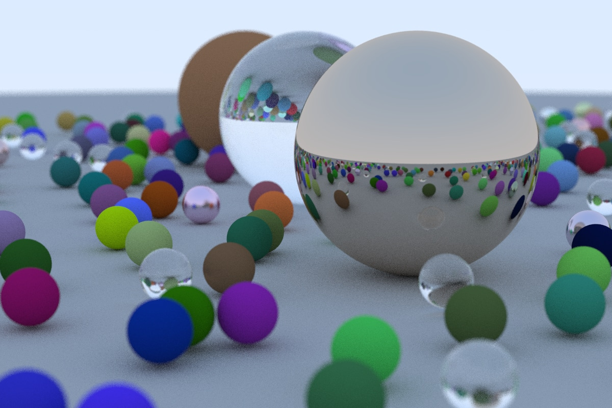

# Que faire-ensuite

Déjà, nous allons recréer l'image de la couverture de ce livre : plein de sphères aléatoires :

```cpp
hittable_list random_scene() {
    hittable_list world;

    world.add(make_shared<sphere>(
        vec3(0,-1000,0), 1000, make_shared<lambertian>(vec3(0.5, 0.5, 0.5))));

    int i = 1;
    for (int a = -11; a < 11; a++) {
        for (int b = -11; b < 11; b++) {
            auto choose_mat = random_double();
            vec3 center(a + 0.9*random_double(), 0.2, b + 0.9*random_double());
            if ((center - vec3(4, 0.2, 0)).length() > 0.9) {
                if (choose_mat < 0.8) {
                    // diffuse
                    auto albedo = vec3::random() * vec3::random();
                    world.add(
                        make_shared<sphere>(center, 0.2, make_shared<lambertian>(albedo)));
                } else if (choose_mat < 0.95) {
                    // metal
                    auto albedo = vec3::random(.5, 1);
                    auto fuzz = random_double(0, .5);
                    world.add(
                        make_shared<sphere>(center, 0.2, make_shared<metal>(albedo, fuzz)));
                } else {
                    // glass
                    world.add(make_shared<sphere>(center, 0.2, make_shared<dielectric>(1.5)));
                }
            }
        }
    }

    world.add(make_shared<sphere>(vec3(0, 1, 0), 1.0, make_shared<dielectric>(1.5)));

    world.add(
        make_shared<sphere>(vec3(-4, 1, 0), 1.0, make_shared<lambertian>(vec3(0.4, 0.2, 0.1))));

    world.add(
        make_shared<sphere>(vec3(4, 1, 0), 1.0, make_shared<metal>(vec3(0.7, 0.6, 0.5), 0.0)));

    return world;
}

int main() {
    ...
    auto world = random_scene();

    vec3 lookfrom(13,2,3);
    vec3 lookat(0,0,0);
    vec3 vup(0,1,0);
    auto dist_to_focus = 10.0;
    auto aperture = 0.1;

    camera cam(lookfrom, lookat, vup, 20, aspect_ratio, aperture, dist_to_focus);
    ...
}
```

Ce qui nous donne la scène finale suivante :



Un point intéressant à noter est que les sphères en verre n'ont apparemment pas d'ombre, ce qui donne l'impression qu'elles flottent dans l'air. Ce n'est pas un bug (vous ne voyez pas de sphères de verre souvent dans la réalité, elles apparaissent pourtant de cette façon, sans ombre, notamment les jours nuageux). Un point sur la grande sphère sous une sphère de verre reçoit pourtant beaucoup de lumière.  C'est dû au fait que le ciel est ré-arrangé plutôt que bloqué.

Vous avez maintenant un ray tracer cool ! Que faire-ensuite ?

1. Les lumières. Vous pouvez le faire explicitement, en envoyant des rayons d'ombre aux lumières. Ou ça peut être fait implicitement en faisant en sorte que des objets puissent émettre de la lumière.

2. La polarisation a dispersé les rayons vers eux, puis la sous-pondération de ces rayons pour annuler le biais. Les deux fonctionnent. Je préfère cette dernière approche même si elle ne fait pas l'hunanimité.

3. Les triangles. Les modèles chouettes sont composés de triangles. Le modèle d'I/O est le plus dur, et chacun essaye de copier le code de quelqu'un d'autre pour faire ça.

4. Les textures de surface. Ca vous permet de coller des images sur vos modèles comme du papier-peint. Assez facile et un bon ajout à notre ray tracer.

5. Des textures solides. Ken Perlin a son code en ligne. Andrew Kensler a pas mals d'informations intéressantes à ce sujet sur son blog.

6. Gestion des volumes et media. Quelque chose de sympa et qui challengera votre architecture logicielle. Ma solution est de faire un volume qui a une interface `hittable` et de façon probabilistique, a ses intersections basées sur sa densité. Votre code de rendu n'a pas à savoir qu'il a des volumes avec cette méthode.

7. Parallélisme. Lancer \\(N\\) copies de votre code sur \\(N\\) coeurs avec differentes graines aléatoires (*random seeds*). Moyenner les \\(N\\) lancements. La moyenne peut aussi se faire hierarchiquement où \\(N/2\\) paires pour obtenir \\(N/4\\) images, et ces paires peuvent ensuite être moyennées. Cette méthode de parallélisation devrait s'étendre bien à des machines équipées de milliers de coeurs et avec très peu de code.

Amusez-vous et envoyez-moi vos images sympas !